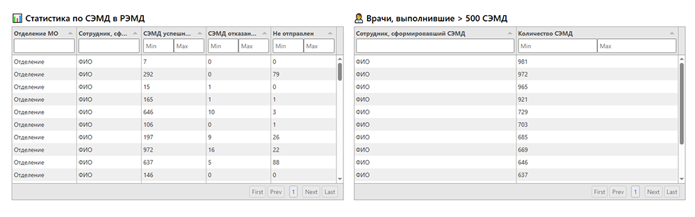
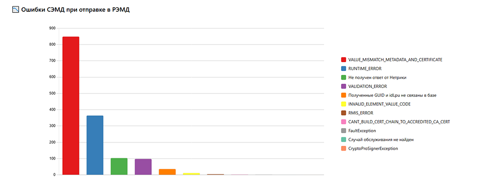

<div align="center">

<h1 align="center">
  
  <span style="vertical-align: middle;">Remora.Analytics</span>
</h1>

<p><i>Self-hosted приложение для анализа выгрузок из МИС «БАРС»</i></p>
<p>Загрузи Excel — получи визуализацию и отчёты без лишней магии.</p>

</div>

---

## 📚 Навигация

- [✨ Что делает Remora.Analytics](#-что-делает-remoraanalytics)
- [🖼️ Пример интерфейса](#️-пример-интерфейса)
- [🚀 Установка и запуск](#-установка-и-запуск)
  - [🐳 Вариант 1: Docker](#-вариант-1-через-docker-рекомендуется)
  - [💻 Вариант 2: Локальный запуск](#-вариант-2-локальный-запуск-без-docker)
- [⚙️ Конфигурация через `.env`](#️-конфигурация-через-env)
- [🔐 Безопасность](#-безопасность)

---

## ✨ Что делает Remora.Analytics

Remora.Analytics — это FastAPI-приложение для моментального анализа выгрузок из МИС «БАРС» в формате `.xlsx`.

---

### Возможности:

- 📥 Загрузи Excel-файл (статистика СЭМД)
- 📊 Получи готовые графики и таблицы:
  - Статистика по отделениям
  - Список врачей, выполнивших >500 СЭМД
  - Вывод ошибок СЭМД при отправке в РЭМД графиком
  - Ошибки при выборе сертификата
- 💾 Автоматическое сохранение последнего загруженного файла
- 🔐 Простая авторизация по логину и паролю (из `.env`)
- 🖥 Работа полностью локально — ничего не уходит в интернет

---

### 🖼️ Пример интерфейса

Таблицы статистики по СЭМД в РЭМД и Врачи, выполнившие > 500 СЭМД:



Столбчатая диаграмма ошибок СЭМД при отправке в РЭМД:



---

## 🚀 Установка и запуск

### 🐳 Вариант 1: через Docker (рекомендуется)

#### 1. Установите Docker

📦 **Для Debian/Ubuntu (APT):**

```bash
sudo apt update
sudo apt install -y docker.io
sudo systemctl start docker
sudo systemctl enable docker
```

📦 **Для RHEL/CentOS/AlmaLinux (YUM):**

```bash
sudo yum install -y docker
sudo systemctl start docker
sudo systemctl enable docker
```

📖 Альтернатива: [Официальная инструкция](https://docs.docker.com/engine/install)

#### 2. Установите Docker Compose

```bash
sudo apt install -y docker-compose
```

Проверьте:

```bash
docker-compose --version
```

#### 3. Склонируйте репозиторий

```bash
git clone https://github.com/fumblerill/remora_analytics.git
cd remora_analytics
```

#### 4. Скопируйте и настройте .env

```bash
cp .env.example .env
nano .env  # редактируем при необходимости (желательно сменить пользователей) (Ctrl + O — сохранить, Ctrl + X — выйти)
```

#### 5. Создайте папку для загружаемых файлов

```bash
mkdir uploaded
```

#### 6. Соберите и запустите контейнер

```bash
docker-compose up --build -d
```

#### 7. Проверьте, что контейнер запущен

```bash
docker ps
```

#### 8. Перейдите в браузере

```
http://localhost:8000
```

(или по другому порту, если указали в `.env`)

### 💻 Вариант 2: Локальный запуск (без Docker)

> Подходит для разработки или если Docker недоступен

#### 1. Убедитесь, что установлен Python 3.10+

```bash
python3 --version
```

#### 2. Установите зависимости

```bash
pip install -r requirements.txt
```

#### 3. Скопируйте .env

```bash
cp .env.example .env
```

#### 4. Запустите приложение

```bash
python main.py
```

#### 5. Перейдите в браузере

```
http://localhost:8000
```

---

## ⚙️ Конфигурация через `.env`

Файл `.env` используется для настройки приложения без изменения кода.

Пример:

```env
SECRET_KEY=your-secret-key
USERS={"admin": "1234", "user": "pass"}
HOST=0.0.0.0
PORT=8000
RELOAD=False
```

### 🔑 Описание переменных:

| Переменная   | Описание                                                                 |
|--------------|--------------------------------------------------------------------------|
| `SECRET_KEY` | Строка, используемая как секретный ключ (например, для токенов или хэшей) |
| `USERS`      | JSON-словарь с логинами и паролями (`{"admin": "1234", "user": "pass"}`) |
| `HOST`       | IP-адрес, на котором работает FastAPI (`0.0.0.0` для работы в Docker)    |
| `PORT`       | Порт, который слушает приложение внутри контейнера                       |
| `RELOAD`     | Включить режим автообновления при изменении кода (`True` для локалки)    |

> ⚠️ Пароли не шифруются. Для безопасного использования в проде стоит добавить хэширование или перейти на полноценную систему авторизации.

---

## 🔐 Безопасность

Приложение разработано **исключительно для внутреннего использования в доверенной сети** (например, локальной сети учреждения).

Не запускайте его в открытом интернете без доработки по следующим причинам:

- 🔓 Авторизация реализована примитивно (логин/пароль из `.env`, без хэширования)
- 🔐 Нет защиты от CSRF/XSS
- 📡 Соединение не защищено (нет HTTPS)
- 🧾 Персональные данные не шифруются и не логируются отдельно

> ⚠️ В случае утечки данных ответственность несёт лицо, самостоятельно развернувшее и неправильно сконфигурировавшее приложение вопреки этим предупреждениям.

---

## 📜 Лицензия

Этот проект распространяется по лицензии [MIT](LICENSE).

> Использование в продуктивной среде допускается только при понимании всех рисков, связанных с обработкой персональных данных. Подробнее — см. [🔐 Безопасность](#-безопасность).